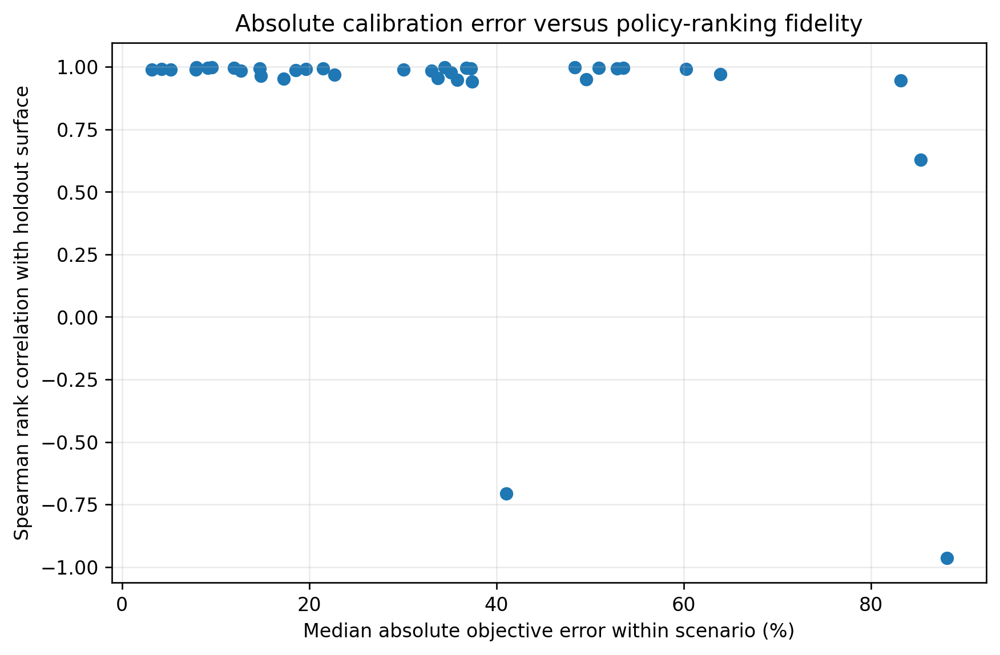
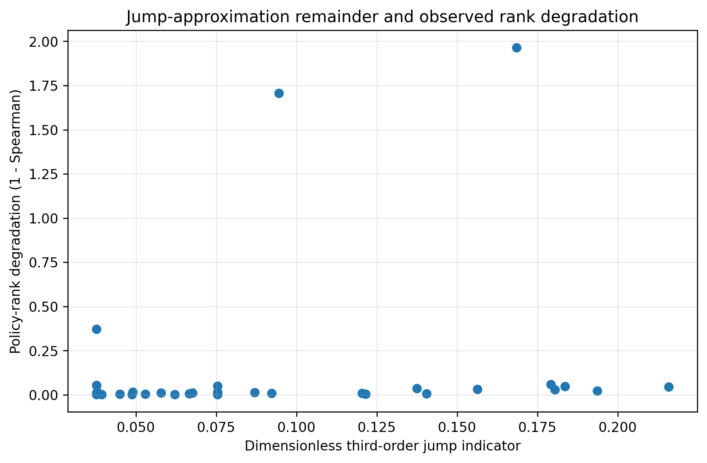
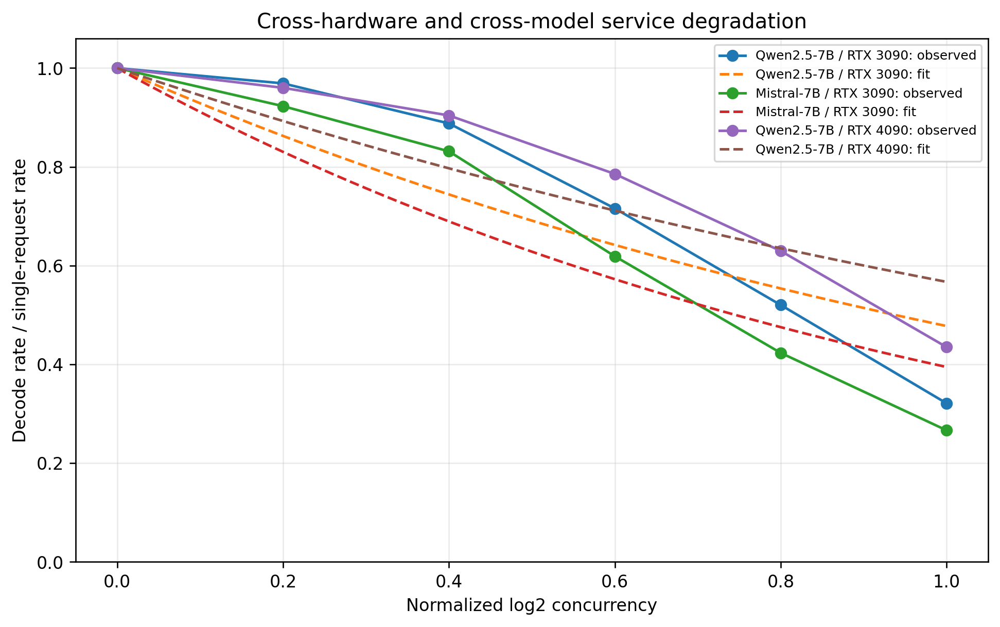
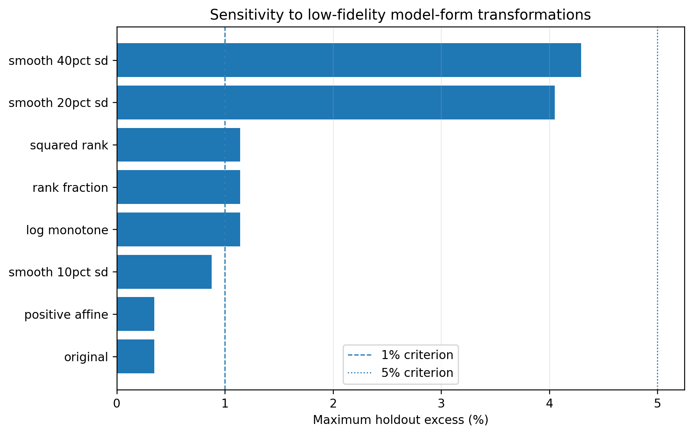
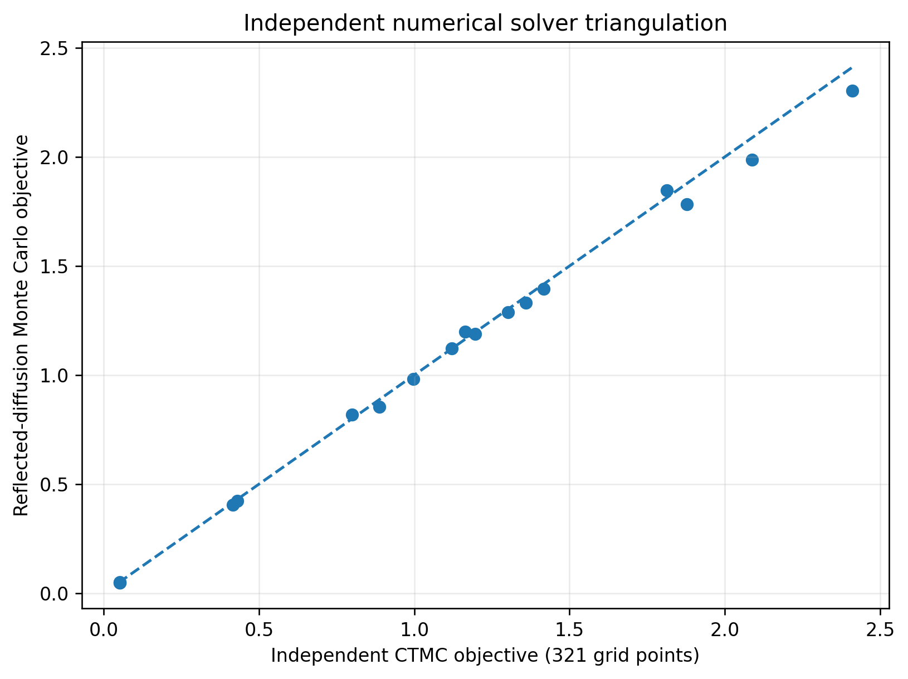

# Independent Analytical and Hardware-Calibrated Model-Form Validation

## Status and claim boundary

This is a **retrospective, post hoc validation campaign** performed after the primary manuscript results were available. It was not preregistered. It uses archived policy surfaces and previously collected hardware telemetry; no new hardware run was performed.

The campaign tests implementation reproducibility, analytical approximation limits, policy-ranking stability, service-law transport, low-fidelity model-form sensitivity, and independent numerical triangulation. It does **not** provide end-to-end controller execution, hardware-in-the-loop validation, or production-safety evidence.

## Principal findings

### 1. Independent optimizer reimplementation

| Method | Runs within 1% | Runs within 5% | Maximum excess | Exact training-policy recovery |
|---|---:|---:|---:|---:|
| DR-BGS | 100.0% | 100.0% | 0.348% | 88.9% |
| Guarded GP | 100.0% | 100.0% | 0.878% | 86.1% |

A clean implementation of the fixed anchors, Matérn-5/2 residual GP, noise handling, lower-confidence acquisition, and five initialization seeds reproduced the manuscript's 0.348% and 0.878% worst cases.

### 2. Policy-surface validity

- Median diffusion-versus-holdout Spearman correlation: **0.989** (scenario-bootstrap 95% interval 0.977–0.992).
- 10th-percentile Spearman correlation: **0.943**.
- Median Kendall correlation: **0.921**.
- Median diffusion/holdout top-20 overlap: **85.0%**.
- Exhaustive training optimum contained in the diffusion top 20: **86.1%** of scenarios.
- Median scenario-level absolute objective error: **33.4%**.

The diffusion-best policy exactly matches exhaustive training selection in only 50.0% of scenarios; its 90th-percentile and maximum holdout excesses are 5.68% and 13.86%. This validates the paper's use of the diffusion as a trend rather than a final selector or risk estimator.

{ width=75% }

### 3. Analytical jump-error indicators

For an interior smooth test function, the third-order Taylor remainder of the compound-jump generator satisfies

$$|R_3 f| \leq \frac{M_3}{6}\lVert f'''\rVert_\infty,$$

where $M_2$ and $M_3$ are arrival-rate-weighted second and third raw jump moments. Scaling derivatives by capacity gives the dimensionless indicator $M_3/(3KM_2)$.

- Median third-order indicator: **0.075**.
- Maximum third-order indicator: **0.216**.
- Median protected-jump probability of exceeding the final 5% of capacity: **0.484**.
- Median eligible-jump probability of exceeding the final 5% of capacity: **0.404**.

Jump coefficient of variation has a Spearman association of 0.438 with rank degradation; the third-order indicator has an association of 0.348. These are diagnostic associations, not causal results.

{ width=72% }

### 4. Direct hardware service-law validation

The Qwen2.5-7B / RTX 3090 direct-telemetry fit is $\widehat\mu(z)=53.6138\exp(-0.034451z)$.

The exponential model has RMSE 0.789 tokens/s, $R^2=0.9961$, AICc 5.16, and leave-one-level-out RMSE 1.299 tokens/s. It outperforms the reciprocal, linear, and quadratic alternatives on AICc or leave-one-out prediction.

A 10,000-draw parametric bootstrap gives intercept interval 53.376–53.857 and decay interval 0.03326–0.03567. A separately aggregated RTX 3090 curve differs from the principal normalized curve by RMSE 0.0099, with no ranking reversal.

### 5. Cross-hardware and cross-model transport

All three primary domains—Qwen/RTX 3090, Mistral/RTX 3090, and Qwen/RTX 4090—show strictly monotone decline across concurrency.

- Pairwise normalized-curve RMSE: **0.067–0.133**.
- Leave-one-domain-out normalized RMSE: **0.103–0.131**.
- Shared normalized exponential $R^2$: **0.812**.

The decreasing form transfers more consistently than its coefficient. The evidence supports model-form grounding, not coefficient transfer or controller validation.

{ width=82% }

### 6. Low-fidelity model-form stress

Positive affine transformation leaves the selection result unchanged, as expected from affine trend recalibration. Monotone log/rank transformations and smooth coordinate perturbations change some selections, but every tested variant remains within 5% of exhaustive training selection in all 180 runs.

The strongest smooth perturbation has median Kendall correlation 0.944 with the original low-fidelity ranking and maximum holdout excess 4.29%. These are heuristic post hoc stress tests, not a physical replacement for rerunning the simulator under a new service law.

{ width=82% }

### 7. Independent solver triangulation

An independently implemented CTMC solver was applied to 18 unique policy cases across six factorial, robustness, and fresh scenarios. A separate Euler–Maruyama reflected-diffusion simulation supplied a stochastic cross-check.

- Median relative discrepancy between the independent 161-point CTMC and archived objective: **below 0.0001%**.
- Maximum CTMC/archive discrepancy: **0.608%**.
- Median and maximum 161-to-321 grid changes: **1.17%** and **2.25%**.
- Monte Carlo versus 321-point CTMC: median **2.52%**, 90th percentile **4.94%**, maximum **6.67%**.
- Median within-scenario policy-rank Spearman: **1.0**.
- Best-policy agreement: **83.3%**.

The one best-policy disagreement occurs among near-tied policies. The triangulation is consistent at policy scale but is not an exact proof of equivalence.

{ width=72% }

## Overall interpretation

The campaign materially strengthens implementation reproducibility, numerical triangulation, the mathematical explanation of diffusion error, policy-ranking robustness, and cross-hardware/model service-law shape grounding.

It does not remove the central empirical limitation: the complete activation–release controller has not been executed end to end on a live cloud–edge system. The defensible label is **retrospective analytical and hardware-calibrated model-form validation**.
